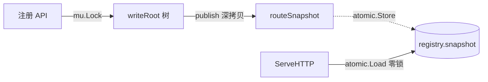

一个轻量、零依赖的 Go web 路由器。

特性：

- 段级压缩前缀树（radix tree），纯静态路径走 O(1) 哈希快速通道
- 注册 / 匹配并发安全：写端串行 + 原子快照，读端零锁
- 路由热更新：runtime 注册即对后续请求生效，已在途请求不受影响
- 中间件按注册顺序生效，仅作用于其后注册的路由
- 405 + Allow（路径命中、方法不允许）按 RFC 返回
- 客户端断开经 `ctx.Done()` 自动传播到 handler
- 注册期 dry-run 校验，非法路径不污染路由树

```shell
go get github.com/Rehtt/Kit/web
```

使用 jsoniter：

```shell
go build -tags=jsoniter
```

追求极致速度可以使用 sonic 编码和解码 JSON：

```shell
go build -tags=sonic
```

## 快速开始

```go
package main

import (
	"fmt"

	"github.com/Rehtt/Kit/web"
)

func main() {
	g := web.New()
	g.SetValue("test", "123")

	g.HeadMiddleware(func(ctx *web.Context) {
		fmt.Println("中间件")
	})
	g.NoRoute(func(ctx *web.Context) {
		ctx.Writer.Write([]byte("找不到啊大佬"))
	})

	g.Any("/123/#asd/234", func(ctx *web.Context) {
		fmt.Println(ctx.GetUrlPathParam("asd"), "获取动态路由参数")
	})
	// curl 127.0.0.1:9090/123/zxcv/234
	// print: zxcv 获取动态路由参数

	g.Any("/1234/#...", func(ctx *web.Context) {
		fmt.Println(ctx.GetUrlPathParam("#"), "获取参数")
	})
	// curl 127.0.0.1:9090/1234/qwe/asd/sdf
	// print: qwe/asd/sdf 获取参数

	api := g.Grep("/api")
	api.GET("/test", func(ctx *web.Context) {
		fmt.Println(ctx.GetContextValue("test"))
	})

	// /#... 兜底
	g.GET("/#...", func(ctx *web.Context) {
		fmt.Println(ctx.GetUrlPathParam("#"))
	})
	// curl 127.0.0.1:9090/asd/asd
	// print: asd/asd

	g.Run(":9090")
}
```

## 路由匹配规则

- 静态：`/api/v1/users`
- 命名参数：`/u/#id`，handler 内 `ctx.GetUrlPathParam("id")` 取值
- 通配尾段：`/files/#...`，handler 内 `ctx.GetUrlPathParam("#")` 取拼接后的剩余路径
- 优先级：静态 > `#name` > `#...`

## API 速览

注册：`GET / POST / PUT / DELETE / HEAD / OPTIONS / CONNECT / Any`

分组与中间件：

- `Grep(path) *RouterGroup`：取或创建子节点；落在压缩边中段会自动分裂
- `HeadMiddleware(...)`：handler 之前运行
- `FootMiddleware(...)`：handler 之后运行
- `NoRoute(handler)`：自定义 404

辅助：

- `List() (methods, paths []string)`：按 `(path, method)` 字典序输出全部路由
- `BottomNodeList() []*RouterGroup`：取所有叶子节点（写端视图）
- `SetValue / GetValue`：在 GOweb 上挂全局值，handler 内通过 `ctx.GetContextValue` 读
- `Run(addr) / RunTLS(addr, cert, key)`：启动监听

## 行为约定

- `Any` 与具体方法在同一路径上互斥，重复注册会 panic
- 同路径同方法重复注册会 panic
- 非法路径（`#...` 不在末尾、参数名冲突、空 `#` 等）在注册阶段 dry-run 校验，错误时不会留下孤儿节点
- 请求路径以 `r.URL.Path`（已解码）匹配，自动剥离 `?query`
- 路径命中但方法不匹配时返回 `405`，并在响应头写入 `Allow: GET, PUT, ...`
- handler `panic` 由内部 `defer` 兜底回收 `Context` 并上抛，由 `net/http` 写 500
- ServeHTTP 父 context 取自 `request.Context()`，客户端断开会传到 handler 的 `ctx.Done()`

## 并发模型

写端持锁串行修改可变树，写完深拷贝出只读快照原子替换；读端只读快照，零锁、零分配额外结构。



## 性能对比

```go
g := web.New()
g.GET("/ping", func(ctx *web.Context) {
	ctx.Writer.Write([]byte("pong"))
})
http.ListenAndServe(":8070", g)
```

```shell
$ wrk -d 100s -c 1024 -t 8 http://127.0.0.1:8070/ping
Running 2m test @ http://127.0.0.1:8070/ping
  8 threads and 1024 connections
  Thread Stats   Avg      Stdev     Max   +/- Stdev
    Latency     4.30ms    5.17ms  92.06ms   86.25%
    Req/Sec    42.37k     7.90k  130.44k    69.17%
  33674619 requests in 1.67m, 3.76GB read
  Socket errors: connect 0, read 0, write 0, timeout 38
Requests/sec: 336435.08
Transfer/sec:     38.50MB
```

gin：

```go
g := gin.New()
g.GET("/ping", func(context *gin.Context) {
	context.Writer.Write([]byte("pong"))
})
http.ListenAndServe(":8060", g)
```

```shell
wrk -d 100s -c 1024 -t 8 http://127.0.0.1:8060/ping
Running 2m test @ http://127.0.0.1:8060/ping
  8 threads and 1024 connections
  Thread Stats   Avg      Stdev     Max   +/- Stdev
    Latency     4.43ms    5.99ms 224.24ms   87.84%
    Req/Sec    43.33k     9.81k  112.97k    71.84%
  34451839 requests in 1.67m, 3.85GB read
  Socket errors: connect 0, read 0, write 0, timeout 100
Requests/sec: 344178.03
Transfer/sec:     39.39MB
```
