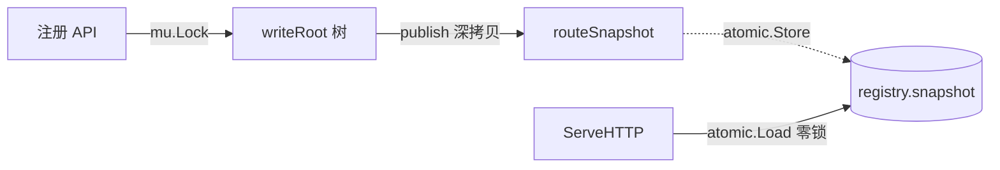

一个轻量、零依赖的 Go web 路由器。

特性：

- 段级压缩前缀树（radix tree），纯静态路径走 O(1) 哈希快速通道
- 注册 / 匹配并发安全：写端串行 + 原子快照，读端零锁
- 路由热更新：runtime 注册即对后续请求生效，已在途请求不受影响
- 洋葱式中间件：`ctx.Next()` 控制后续链，未显式调用也会自动继续
- 中间件按注册顺序生效，仅作用于其后注册的路由
- 内置 `*http.Server`，默认超时齐全，支持优雅关停
- 可定制的 `OnPanic` 钩子，默认打印堆栈 + 写 500
- `ctx.Writer` 跟踪 status/size/written，透传 Flusher/Hijacker/Pusher
- HEAD 自动回落到 GET，405 自动写 Allow
- 客户端断开经 `ctx.Done()` 自动传播到 handler
- 注册期 dry-run 校验，非法路径不污染路由树

```shell
go get github.com/Rehtt/Kit/web
```

使用 jsoniter：

```shell
go build -tags=jsoniter
```

追求极致速度可以使用 sonic 编码和解码 JSON：

```shell
go build -tags=sonic
```

## 快速开始

```go
package main

import (
	"fmt"

	"github.com/Rehtt/Kit/web"
)

func main() {
	g := web.New()
	g.SetValue("test", "123")

	g.HeadMiddleware(func(ctx *web.Context) {
		fmt.Println("中间件")
	})
	g.NoRoute(func(ctx *web.Context) {
		ctx.Writer.Write([]byte("找不到啊大佬"))
	})

	g.Any("/123/#asd/234", func(ctx *web.Context) {
		fmt.Println(ctx.GetUrlPathParam("asd"), "获取动态路由参数")
	})
	// curl 127.0.0.1:9090/123/zxcv/234
	// print: zxcv 获取动态路由参数

	g.Any("/1234/#...", func(ctx *web.Context) {
		fmt.Println(ctx.GetUrlPathParam("#"), "获取参数")
	})
	// curl 127.0.0.1:9090/1234/qwe/asd/sdf
	// print: qwe/asd/sdf 获取参数

	api := g.Grep("/api")
	api.GET("/test", func(ctx *web.Context) {
		fmt.Println(ctx.GetContextValue("test"))
	})

	// /#... 兜底
	g.GET("/#...", func(ctx *web.Context) {
		fmt.Println(ctx.GetUrlPathParam("#"))
	})
	// curl 127.0.0.1:9090/asd/asd
	// print: asd/asd

	g.Run(":9090")
}
```

## 路由匹配规则

- 静态：`/api/v1/users`
- 命名参数：`/u/#id`，handler 内 `ctx.GetUrlPathParam("id")` 取值
- 通配尾段：`/files/#...`，handler 内 `ctx.GetUrlPathParam("#")` 取拼接后的剩余路径
- 优先级：静态 > `#name` > `#...`

## API 速览

注册：`GET / POST / PUT / DELETE / HEAD / OPTIONS / CONNECT / Any`

分组与中间件：

- `Grep(path) *RouterGroup`：取或创建子节点；落在压缩边中段会自动分裂
- `Middlewares(...)`：洋葱模型中间件，handler 内可调用 `ctx.Next()` 控制后续链
- `HeadMiddleware(...)`：`Middlewares` 的便捷封装，等价于 `func(c){ h(c); c.Next() }`
- `FootMiddleware(...)`：`Middlewares` 的便捷封装，等价于 `func(c){ c.Next(); h(c) }`
- `NoRoute(handler)`：自定义 404

中间件示例（手写洋葱）：

```go
g.Middlewares(func(ctx *web.Context) {
    start := time.Now()
    ctx.Next()                // 让后续 handler 先跑
    log.Printf("%s %s %v", ctx.Request.Method, ctx.Request.URL.Path, time.Since(start))
})
```

服务管理：

- `Run(addr) / RunTLS(addr, cert, key)`：阻塞启动监听
- `RunContext(ctx, addr)`：ctx 取消时自动 Shutdown
- `Shutdown(ctx)`：等价 `g.Server.Shutdown`
- `g.Server`：暴露底层 `*http.Server`，可直接改 TLSConfig / 超时 / ErrorLog
- `WithServer(*http.Server)`：构造期整体替换
- `OnPanic(fn)` / `WithOnPanic(fn)`：自定义 panic 钩子

`ctx.Writer` 实现 `web.ResponseWriter`，可断言读取状态：

```go
rw := ctx.Writer.(web.ResponseWriter)
log.Printf("status=%d size=%d", rw.Status(), rw.Size())
```

可选中间件：

- `web/middleware.Encoding(opts...)`：按 Accept-Encoding 自动 gzip / deflate；默认仅压缩 ≥ 1KB 且命中 Content-Type 白名单的响应

辅助：

- `List() []RouterInfo`：按字典序输出全部路由
- `BottomNodeList() []*RouterGroup`：列出所有叶子节点
- `SetValue / GetValue`：挂全局值，handler 内通过 `ctx.GetContextValue` 读

## 行为约定

- `Any` 与具体方法在同一路径上互斥，重复注册会 panic
- 同路径同方法重复注册会 panic
- 非法路径（`#...` 不在末尾、参数名冲突等）在注册期 dry-run 校验，不会留孤儿节点
- 请求路径以 `r.URL.Path`（已解码）匹配，自动剥离 `?query`
- 405 时写 `Allow: GET, PUT, ...`；HEAD 未注册但有 GET 时自动复用（RFC 9110 §9.3.2）
- handler `panic` 走 `OnPanic` 钩子；`http.ErrAbortHandler` 仍透传给 stdlib
- ServeHTTP 父 ctx 取自 `request.Context()`，`SetValue` 写入的全局值由 `Context.Value()` 自行回退查询
- 多层级中间件按 **root → leaf** 顺序执行；多个 `FootMiddleware` 之间为 **LIFO**
- `ctx.Stop()` 只阻断后续链，当前 handler 需自行 `return`
- `*Context` 是池化资源，handler 启动子 goroutine 时不要持有 `*Context` / `Request` / `Writer`

## 并发模型

写端持锁串行修改可变树，写完深拷贝出只读快照原子替换；读端只读快照，零锁、零分配额外结构。



## 优雅关停

```go
ctx, stop := signal.NotifyContext(context.Background(), os.Interrupt, syscall.SIGTERM)
defer stop()

g := web.New()
g.GET("/ping", func(c *web.Context) { c.Writer.Write([]byte("pong")) })

if err := g.RunContext(ctx, ":9090"); err != nil && err != http.ErrServerClosed {
    log.Fatal(err)
}
```

## 性能

```go
g := web.New()
g.GET("/ping", func(ctx *web.Context) {
	ctx.Writer.Write([]byte("pong"))
})
g.Run(":8070")
```

```shell
$ wrk -d 100s -c 1024 -t 8 http://127.0.0.1:8070/ping
Running 2m test @ http://127.0.0.1:8070/ping
  8 threads and 1024 connections
  Thread Stats   Avg      Stdev     Max   +/- Stdev
    Latency     4.30ms    5.17ms  92.06ms   86.25%
    Req/Sec    42.37k     7.90k  130.44k    69.17%
  33674619 requests in 1.67m, 3.76GB read
  Socket errors: connect 0, read 0, write 0, timeout 38
Requests/sec: 336435.08
Transfer/sec:     38.50MB
```

gin：

```go
g := gin.New()
g.GET("/ping", func(context *gin.Context) {
	context.Writer.Write([]byte("pong"))
})
http.ListenAndServe(":8060", g)
```

```shell
wrk -d 100s -c 1024 -t 8 http://127.0.0.1:8060/ping
Running 2m test @ http://127.0.0.1:8060/ping
  8 threads and 1024 connections
  Thread Stats   Avg      Stdev     Max   +/- Stdev
    Latency     4.43ms    5.99ms 224.24ms   87.84%
    Req/Sec    43.33k     9.81k  112.97k    71.84%
  34451839 requests in 1.67m, 3.85GB read
  Socket errors: connect 0, read 0, write 0, timeout 100
Requests/sec: 344178.03
Transfer/sec:     39.39MB
```
